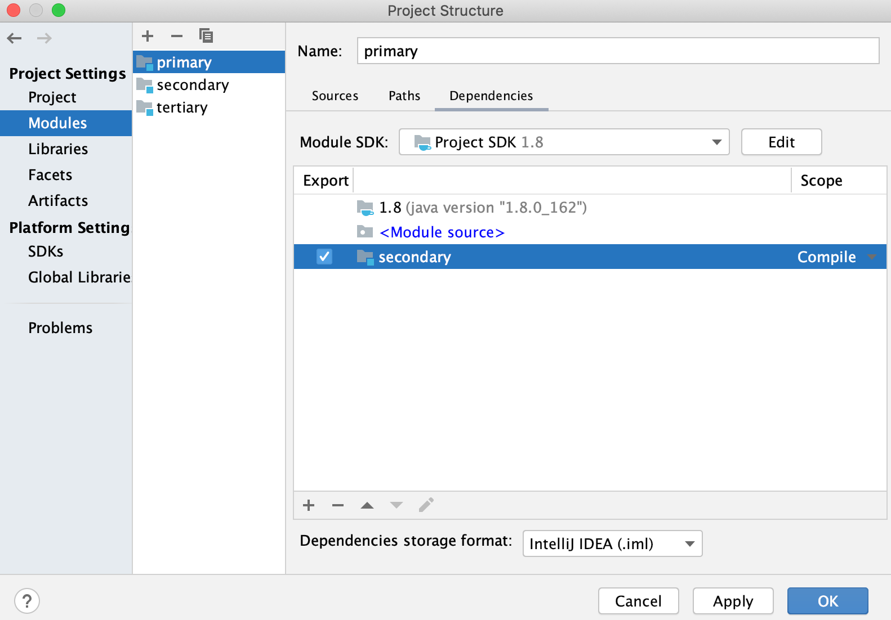
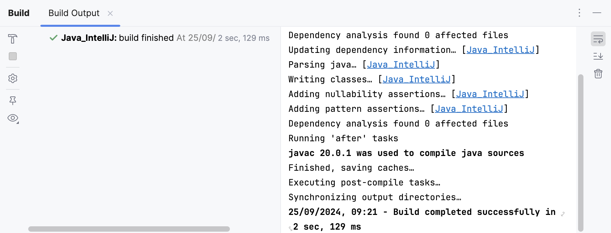
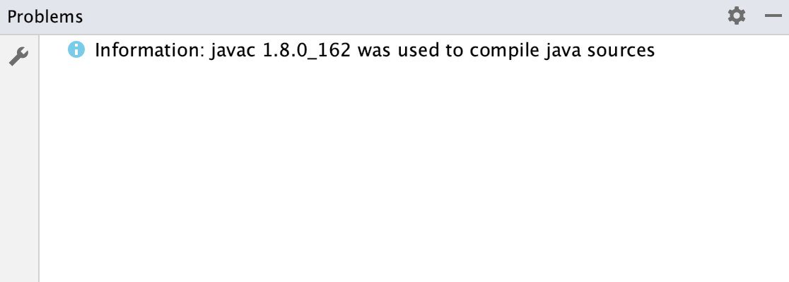

https://www.jetbrains.com/help/idea/compiling-applications.html

* IntelliJ IDEA
  * how does it work?
    * -- via a -- compiler / follows Java specification
  * allows
    * compile 1! file or WHOLE project
    * incremental build / module or a project,
    * rebuild a project -- from -- scratch

* recommendations
  * | pure Java or Kotlin project, 
    * build your project -- via -- IntelliJ IDEA
      * Reason: 🧠 speeds up -- , via incremental build, the -- building process🧠
  * | Gradle or Maven projects / its build script file -- uses -- CUSTOM plugins or tasks
    * use delegation to [Maven](delegate-build-and-run-actions-to-maven.md) or [Gradle](gradle.md)
    * Reason: 🧠IntelliJ IDEA native builder might NOT correctly build 🧠

* compile 1! file or class
  * steps
    * click desired file or class, build, recompile className

# how to change the compilation output locations?
* TODO:

# Build

* Build command -> IntelliJ 
  * compiles ALL the classes | your build target
  * compiled classes are placed | output directory
  * if it's | module or project 
    * -> compilation results | [Review compilation and build output](#review-compilation-and-build-output)
    * & 👀add a module dependency -> compiles recursively / start with the least dependent module 👀
    
      

* if you change SOME build target's class & execute build -> 💡Intellij 
  * compiles -- , via incremental build, -- ONLY the changed classes 💡
  * recursively builds the classes' dependencies

# Rebuild
* TODO:

# Background compilation (auto-build)
* TODO:

# Review compilation and build output
* | [Build tool window](build-sync-tool-window.md), 
  * it's displayed
    * success steps of compilation
    * error & warning messages

  

* if you configured an [auto-build](#background-compilation-auto-build) -> uses Problems tool window

  

# TODO: