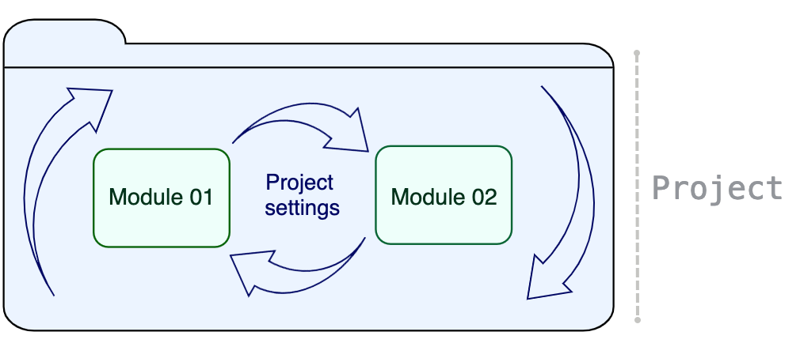
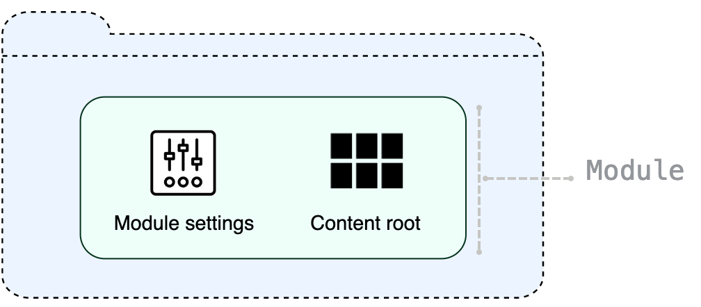
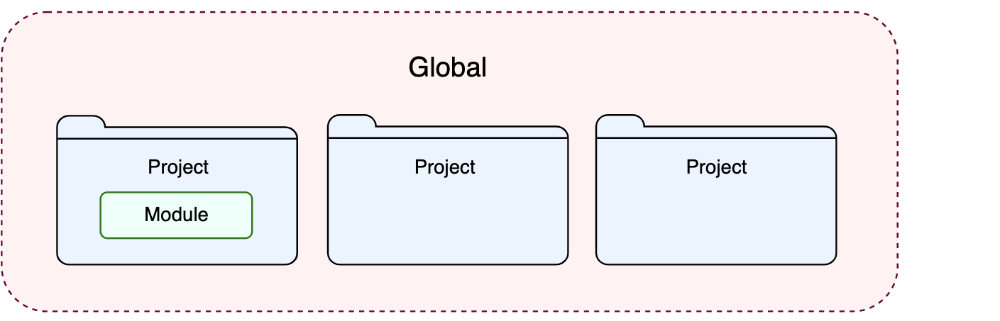

https://www.jetbrains.com/help/idea/working-with-projects.html

* Projects
  * == directory / keeps ALL your application
  * == 👀Project settings + modules👀
    * Project settings
      * scope | CURRENT project
      * place | ".idea/*.xml"
      * allows
        * storing
          * VCS settings,
          * SDKs, code style and spellchecker settings, 
          * compiler output,
          * libraries / AVAILABLE -- for -- ALL project's modules
  * provides
    * dependencies BETWEEN modules

  

* module
  * == module settings + content root
    * module settings
      * ".iml"
      * scope | 1 module
      * -- depend on --
        * SDK & language level
        * specific technology or framework
    * content root
      * == source code + resources + tests + ...

  

* EXISTING settings == project settings + module settings + global settings

  
  
  * global settings
    * scope | ALL projects / SPECIFIC installation of IntelliJ IDEA
    * == IDE appearance (for example, themes and color schemes) + installed and enabled plugins + debugger settings + global inspection profiles + ..